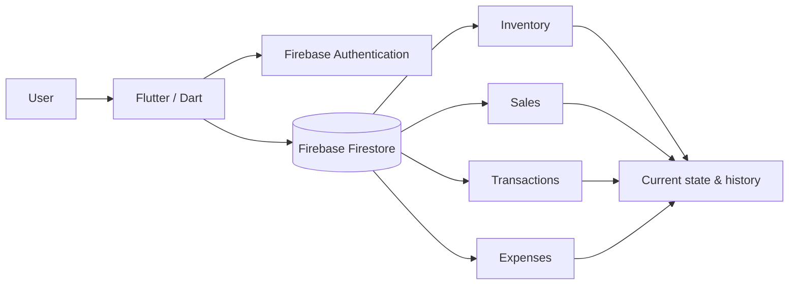

# Inventory & Business Monitoring System

  
  
  
  
  
  

A cloud-backed system for shops and warehouses to track **inventory, stock purchases, sales, expenses, money movements and business history** from one account.

The project started from a practical problem: an owner should be able to see what came in, what went out, how much money moved, and whether the recorded stock and financial state still make sense - without having to be physically present at the shop or warehouse.

## Screenshots

<table>
  <tr>
    <td width="50%"></td>
    <td width="50%"></td>
  </tr>
  <tr>
    <td align="center"><b>Business overview</b></td>
    <td align="center"><b>Stock entry and history</b></td>
  </tr>
</table>

[View the full workflow gallery](docs/WORKFLOWS.md)

## What the system does

- manages inventory items, quantities and cost information;
- records stock purchases and updates the related inventory state;
- records sales, including unpaid/credit amounts;
- records expenses and other money-related activity;
- keeps timestamped sales and transaction history;
- provides daily, weekly, monthly, yearly and all-time summaries;
- uses authenticated, user-specific cloud data that can be accessed from different devices.

## How it works

The implementation preserved in the bachelor report shows Firestore paths scoped to the signed-in user, snapshot streams rendered with Flutter `StreamBuilder`, and transaction logic that updates the corresponding inventory records.

For example, when stock is received, the system records the transaction and then updates the matching item's quantity and cost values. This connection between business events and the current inventory state is one of the main ideas behind the project.

## Tech

- **Flutter / Dart** — UI, navigation, forms and application logic
- **Firebase Firestore** — cloud data, queries, writes and snapshot streams
- **Firebase Authentication** — user-scoped access
- **Android Studio** — original development environment
- **Git / GitHub** — version control

## Project material

- [Bachelor project report](docs/report-parts/README.md)
- [Architecture](docs/ARCHITECTURE.md)
- [Workflow gallery](docs/WORKFLOWS.md)
- [Code excerpts](docs/CODE_INDEX.md)
- [Project evidence](docs/PROJECT_EVIDENCE.md)

The original full development repository is no longer available. This repository preserves the bachelor report, original project screenshots and selected source-code excerpts recovered from the report. Missing files or historical commits have not been recreated.

## Academic context

- **Degree:** Bachelor of Computer Science
- **Institution:** Aria University, Afghanistan
- **Original project title:** *Inventory Management Mobile App*
- **Submitted:** 2022
- **Author:** Sebghatullah Yarzada
- **Supervisor:** Dr. Yama Ramin

