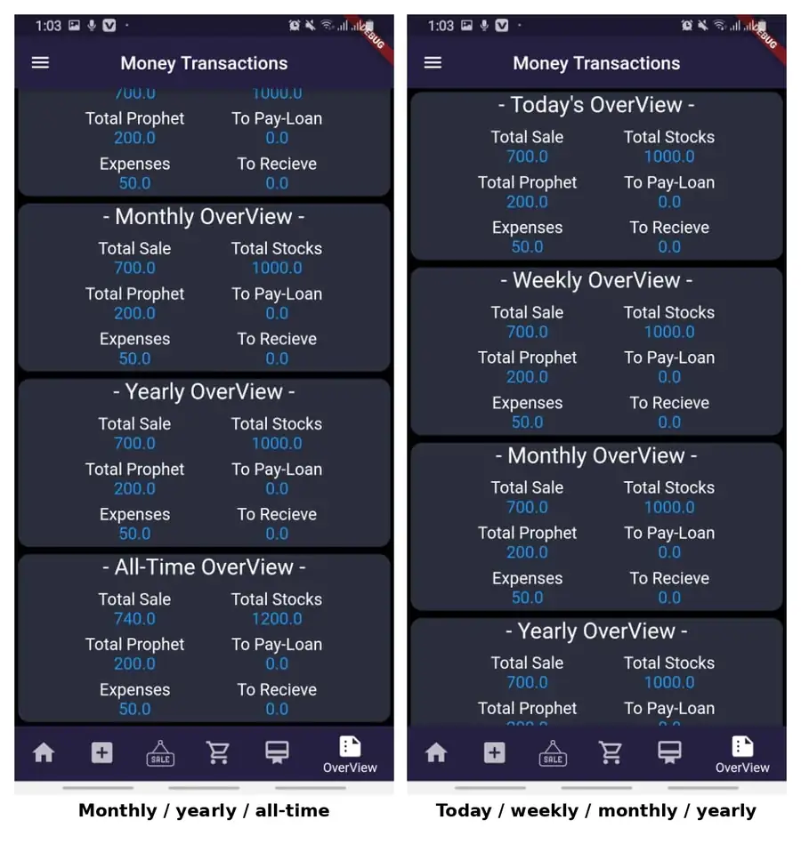
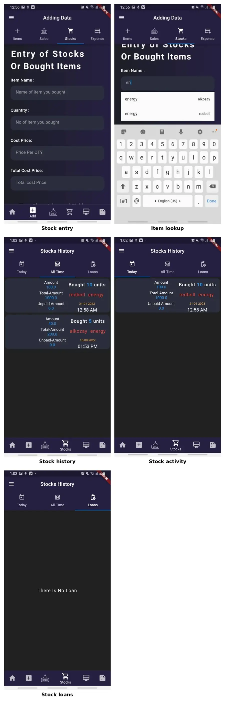

# Inventory & Business Monitoring System

  
  
  
  

A Flutter-based mobile application for managing inventory and monitoring day-to-day business activity across shops and warehouses.

The system brings **inventory, stock purchases, sales, expenses, transaction history and business summaries** into one authenticated, cloud-backed application. It was designed to give a business owner a clear view of operational and financial activity without needing to be physically present at the shop or warehouse.

## Highlights

- Cloud-backed inventory management with Firebase Firestore
- Authenticated, user-specific business data
- Stock purchasing and automatic inventory updates
- Sales recording with support for unpaid / credit amounts
- Expense and transaction tracking
- Searchable inventory and timestamped history
- Daily, weekly, monthly, yearly and all-time business summaries
- Cross-device access through a signed-in account

## Application Preview

<table>
  <tr>
    <td width="50%"></td>
    <td width="50%"></td>
  </tr>
  <tr>
    <td align="center"><b>Business overview</b></td>
    <td align="center"><b>Stock entry and history</b></td>
  </tr>
</table>

[Explore the full application workflow →](docs/WORKFLOWS.md)

## Core Workflows

**Inventory management**  
Create, view, edit and search items while tracking quantities and cost information.

**Stock management**  
Record incoming stock and update the corresponding inventory quantities and cost values.

**Sales**  
Record sold items, selling prices and credit amounts while maintaining timestamped sales history.

**Expenses & transactions**  
Capture business expenses and money movements with historical records.

**Business monitoring**  
Review operational and financial information across daily, weekly, monthly, yearly and all-time views.

## Architecture

~~~mermaid
flowchart LR
    U[Authenticated User] --> A[Flutter / Dart App]
    A --> AU[Firebase Authentication]
    A --> F[(Firebase Firestore)]
    F --> I[Inventory]
    F --> S[Sales]
    F --> T[Transactions]
    F --> E[Expenses]
    I --> O[Business Overview]
    S --> O
    T --> O
    E --> O
~~~

The application uses Firebase Authentication for account access and Firestore for user-scoped cloud data. Flutter snapshot streams keep application views synchronized with stored business data, while stock transactions update the related inventory state.

## Tech Stack

| Technology | Use |
| --- | --- |
| **Flutter / Dart** | Mobile UI, navigation, forms and application logic |
| **Firebase Firestore** | Cloud persistence, queries, writes and real-time data streams |
| **Firebase Authentication** | Authenticated, user-scoped access |
| **Android Studio** | Development environment |
| **Git / GitHub** | Version control and project presentation |

## Implementation

Representative Flutter/Dart source components are available in **source-extracts/**, covering:

- Firestore reads and writes
- authenticated data paths
- inventory updates with FieldValue.increment
- snapshot streams with StreamBuilder
- transaction and sales history
- date-based business overview queries
- application navigation

[View the code index →](docs/CODE_INDEX.md) · [View architecture details →](docs/ARCHITECTURE.md)

## Academic Context

Developed as a **Bachelor of Computer Science** project at **Aria University, Afghanistan**.

**Project:** Inventory Management Mobile App  
**Year:** 2022  
**Author:** Sebghatullah Yarzada  
**Supervisor:** Dr. Yama Ramin

## License

This project is not open source. The repository is available only to showcase the work for academic and portfolio purposes. The code and project materials may not be copied, reused, or redistributed without permission.
