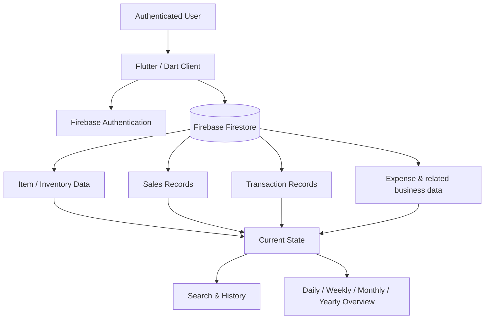
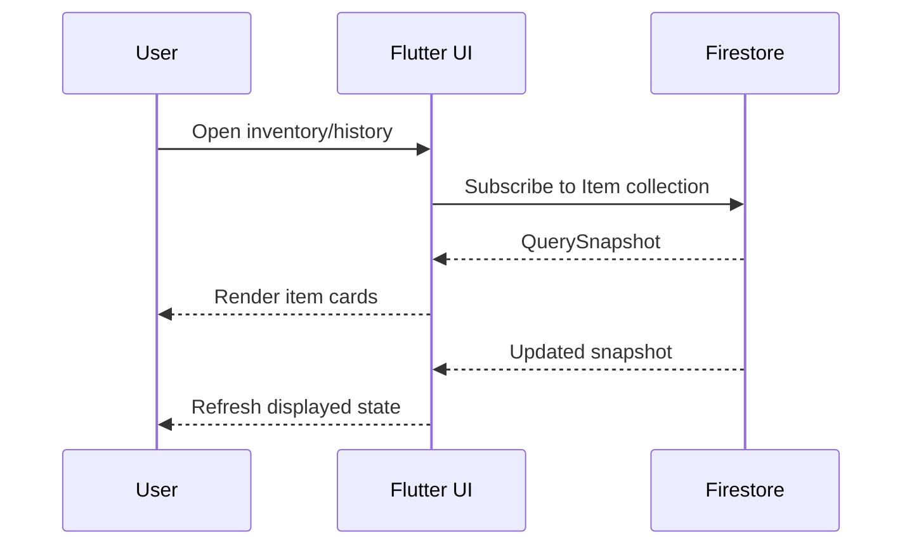
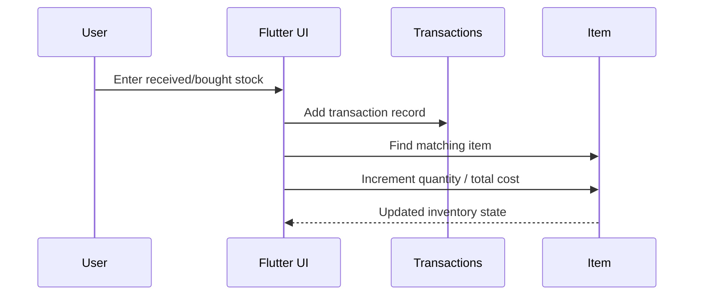

# Architecture

This document explains the architecture evidenced by the bachelor project report and the source code preserved in this repository.

## High-level view



## Design intent

The system was conceived for remote business visibility. The client should allow a shop or warehouse owner to inspect recorded stock, sales, expenses, and monetary activity without needing to physically reconstruct the business state every time.

The important design idea is that inventory is not treated as an isolated list. Business events are recorded and connected to the current state.

## User-scoped data

Recovered code repeatedly uses the authenticated user identifier:

```dart
FirebaseAuth.instance.currentUser!.uid
```

Firestore paths visible in the report include patterns such as:

```text
Iusers/{uid}/Item
Iusers/{uid}/Sales
Iusers/{uid}/Transactions
```

This is evidence that data is stored per signed-in account.

## Inventory read flow

The preserved `ItemHistory` implementation creates a Firestore snapshot stream and renders it with Flutter `StreamBuilder`.



## Stock-entry write flow

A preserved section of the report shows a business event being recorded in the `Transactions` collection and then the corresponding inventory item being located and updated.



The code uses Firestore operations including:

- `add(...)`
- `where(...)`
- `update(...)`
- `FieldValue.increment(...)`

## History and monitoring

The report contains timestamp-ordered sales history and time-based transaction views. A preserved weekly query filters transaction data by `dateTime`, while the UI screenshots show today, weekly, monthly, and yearly business overviews.

This architecture supports two complementary views:

1. **current state** — what the recorded inventory/business state is now;
2. **history** — how that state was reached through recorded business events.

## Public repository boundary

The full bachelor report is preserved in `docs/` as a sanitized public artifact. The original development repository is not represented as fully recovered, so the architecture described above remains limited to what is directly evidenced by the report, original screenshots, and selected report-derived source excerpts.
