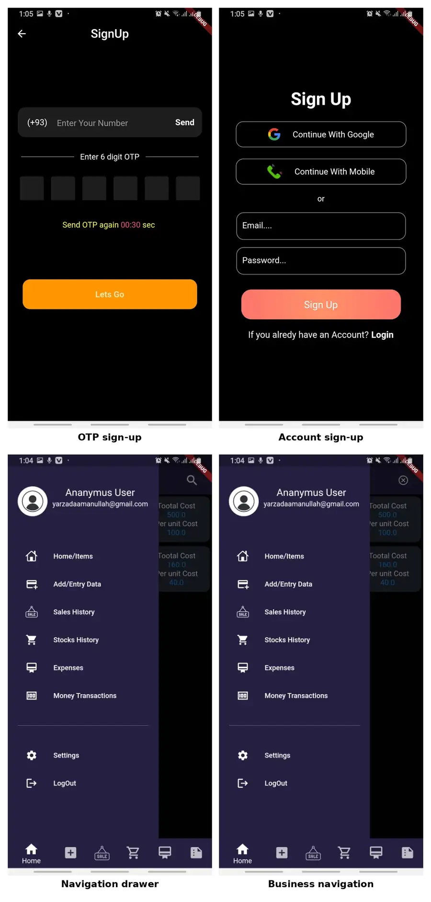
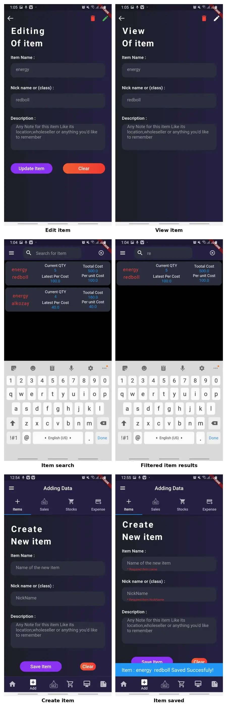
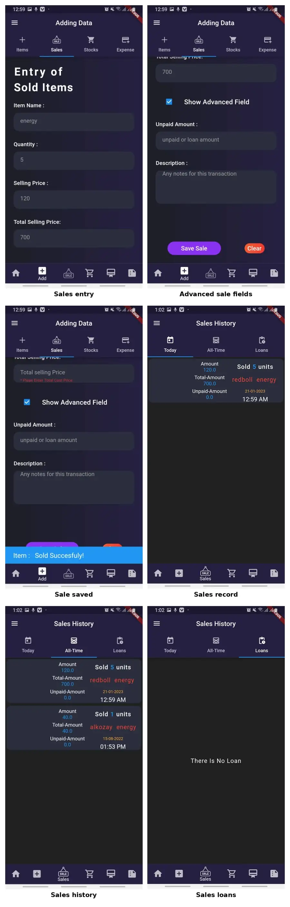
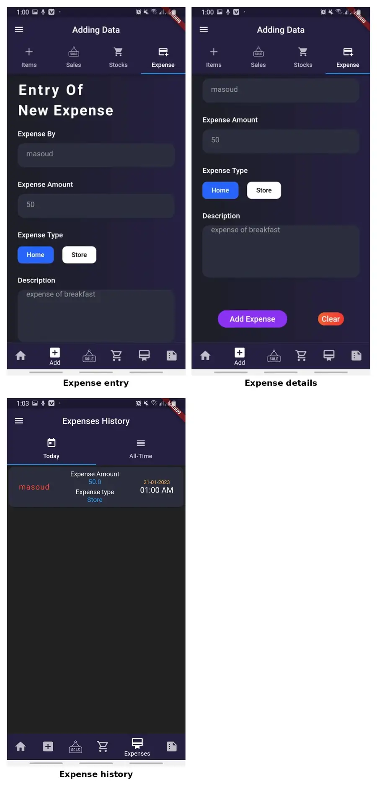

# Project Workflows

The images below are based on the original project screenshots.

## Authentication and navigation

Account access and navigation to the main areas of the system: items, data entry, sales, stock, expenses and money overview.

## Items and search

Create, view, edit and search inventory items. The stored item state includes quantity and cost information.

## Stock entry

Record incoming stock with quantity, purchase cost, total cost and optional credit/loan information. The corresponding inventory record is then updated.

## Sales

Record sold items, quantity, selling price, total price and optional unpaid/credit information, with timestamped sales history.

## Expenses

Record expense amount, type and description, and review expense history.

## Business overview

Review sales, stock values, profit, expenses and outstanding amounts across today, weekly, monthly, yearly and all-time views.
